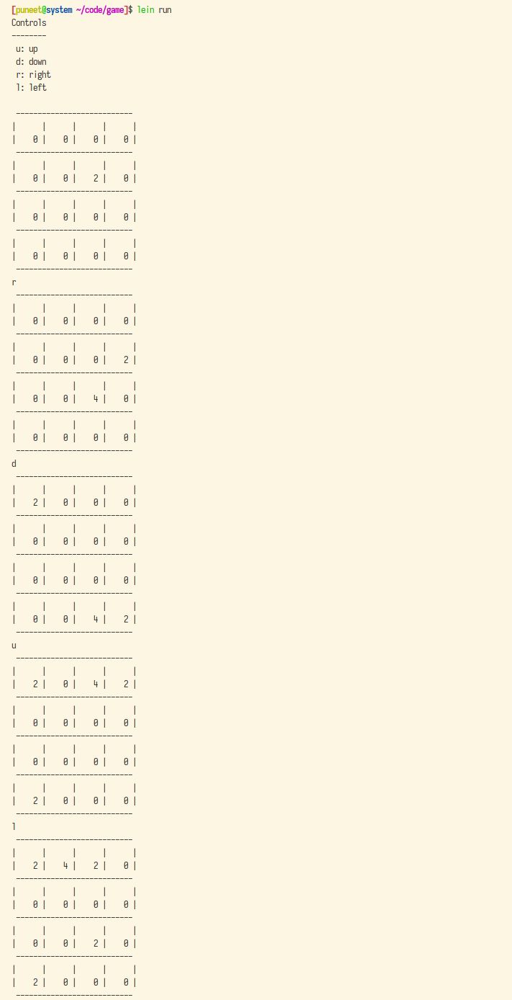

# 2048 game

## How to run
Execute `lein run` in the `game` directory

## How to play
#### Controls
`u`: up  
`d`: down  
`r`: right  
`l`: left

## Rules for new numbers
* If the move does not change the board, no new number is added. Otherwise a new number is added on a random empty location after doing the move.
* `2` is the new number 80% of the time, `4` is the new number 20% of the time (close to the probabilities of https://play2048.co/).
